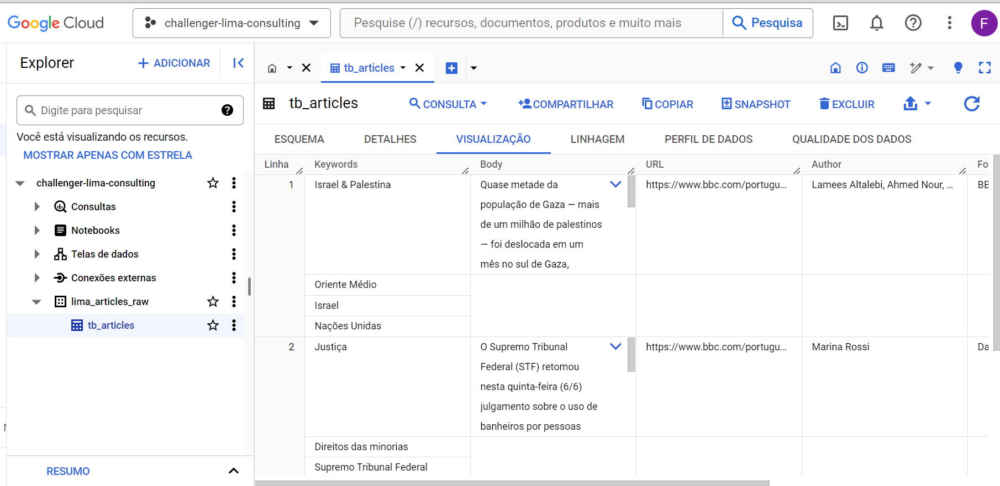
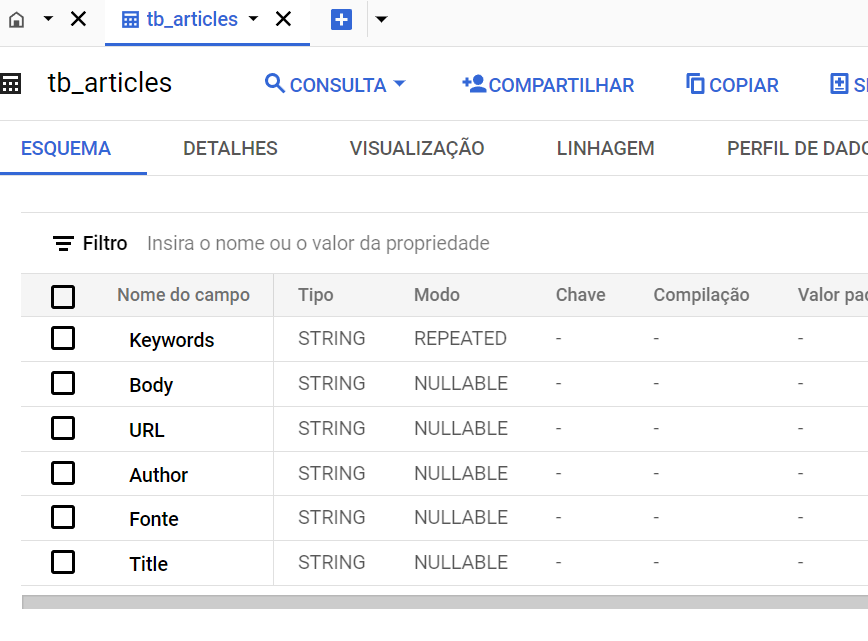
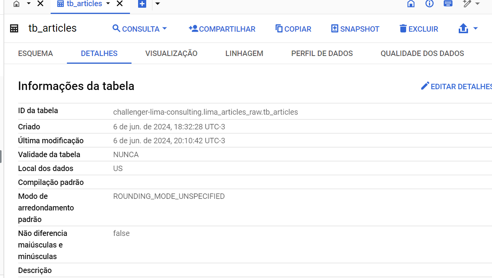

# BBC Scraper

This project is a web scraper for the BBC website. It allows you to retrieve data from specific URLs and display it in a user-friendly format.
[https://www.bbc.com/portuguese](https://www.bbc.com/portuguese)
## Images

Here are some images from the assets folder:




## Getting Started

To run the scraper, follow these steps:

1. Open the command prompt and navigate to the project's working directory.
2. Run the following command to start the server:
    ```
    uvicorn main:app --reload
    ```
3. Once the server is running, open your web browser and go to [https://127.0.0.1:8000/docs](https://127.0.0.1:8000/docs).
4. Click on "Try it out" and enter the URL you want to scrape.
5. Click on "Execute" to initiate the scraping process.
## API Endpoint

To access the scraped data programmatically, you can use the following API endpoint:
[https://desafio-lima2-vszbb4vzda-uc.a.run.app/docs](Api Endpoint)

## Requirements

Make sure you have the following dependencies installed:

``` pip install -r requirements.txt ```

## Contributing

Contributions are welcome! If you find any issues or have suggestions for improvement, please open an issue or submit a pull request.

## License

This project is licensed under the [MIT License](LICENSE).